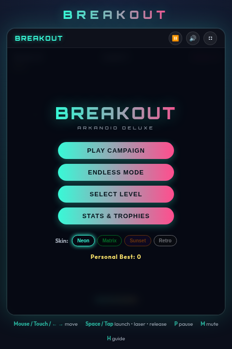
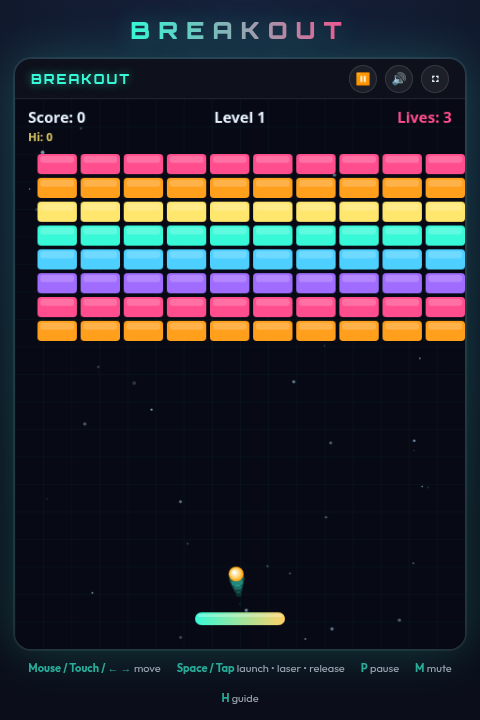
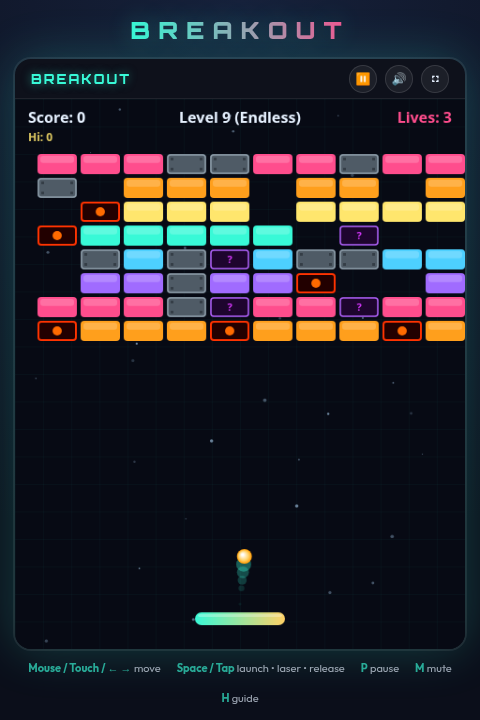

# 📘 Breakout — Strategy Guide

A complete guide to mastering **Breakout / Arkanoid Deluxe**. Read this to maximize your combos, master power-ups/downs, handle hazardous bricks, and dominate the Endless leaderboard.

## 📸 Visual Overview

| Glassmorphic Main Menu | Active Campaign Game | Endless Mode Challenge |
| :---: | :---: | :---: |
|  |  |  |

---

## 1. The Goal

Clear every brick across all **8 campaign levels** without losing all your lives. Beating Level 8 unlocks the legendary Grand Champion achievement. Alternatively, test your stamina in **Endless Mode (Challenge)** starting at Level 9, featuring procedurally generated layouts and progressive speeds.

---

## 2. Controls Refresher

| Action | Input |
|---|---|
| Move Paddle | `Mouse`, `Touch / Swipe`, or `←` / `→` (`A` / `D` keys) |
| Launch / Shoot / Release | `Spacebar` or `Tap / Left-Click Canvas` |
| Pause / Resume | `P` key (or top header `⏸` button) |
| Toggle Audio Mute | `M` key (or top-right header speaker icon) |
| In-game Guide | `H` key |

---

## 3. Ball Physics & Aiming

### The Paddle Spin ("English")
Bounce angles are determined by two elements:
1. **Contact Position**:
   - *Center impact* → Shoots nearly straight up (safe, high control).
   - *Edge impact* → Deflects out at steep angles up to 60° (ideal for penetrating side gaps).
2. **Paddle Motion (Spin)**:
   - Moving the paddle rapidly to the right during contact slices the ball, deflecting it further right.
   - Moving the paddle rapidly left deflects the ball further left.
   - *Tactical Slicing*: Use quick mouse swipes or keyboard taps to slice the ball into steep channels, guiding it behind the brick grid.

---

## 4. Brick Hazards & Features

* **Invincible Metal Bricks** (`M`): Indestructible steel barriers. Use them to deflect balls at creative angles. They do not count toward clearing levels.
* **Explosive Bricks** (`E`): Shattering these triggers an immediate chain reaction, damaging all 8 adjacent bricks. Plan your shots to trigger cascades!
* **Mystery Bricks** (`?`): Dropping a guaranteed random capsule. Prepare for both rewards and hazards!

---

## 5. Power-up & Power-down Catalog

Shattered bricks have an **18% chance** to drop a capsule. Catch capsules with the paddle.

### Positive Power-Ups
* **`WIDE`** (🟦 Blue, ~12s): Expands the paddle. Maximizes safety and catching radius.
* **`MULTI`** (🟨 Yellow, Instant): Splits all active balls into 3 (maximum limit of 8 balls simultaneously).
* **`SLOW`** (🟩 Green, ~9s): Reduces ball velocity. Crucial during high-speed campaign levels or endless waves.
* **`+1`** (💖 Pink, Instant): Awards an extra life. Highest catch priority.
* **`LASER`** (🔴 Red, ~10s): Press `Spacebar` or tap/click canvas repeatedly to shoot lasers, quickly demolishing rows from safety.
* **`FIRE`** (🟧 Orange, ~8s): The fireball plows straight through normal bricks without bouncing.
* **`CATCH`** (🟪 Purple, ~12s): Sticky paddle. Catches the ball on contact. Line up your shot, select a launch direction, and press `Space` to release.
* **`SHIELD`** (💎 Cyan, Until hit): Places a blue barrier line at the bottom. Restores one ball drop.

### Negative Power-Downs
* **`TINY`** (🟥 Dark Red, ~10s): Shrinks paddle to a tiny width (`52px`). Focus on center paddle catches.
* **`FAST`** (🟨 Yellow-Green, ~8s): Increases ball speed by `1.45x`. Best paired with `CATCH` or `SLOW` to recover.
* **`CONFUSE`** (🟪 Deep Purple, ~6s): Inverts your controls (left becomes right, right becomes left). Tip: Use mouse/pointer coordinates and think in reverse, or park in the center.

---

## 6. Campaign Level Chart

| Level | Name / Mechanics | Speed | Hazards & Bricks |
|:---:|---|:---:|---|
| **1** | **Standard Wall** | `5.5` | Baseline 8×10 grid. Standard speed and paddle. |
| **2** | **Diamond Pattern** | `5.95` | Angled layout. Gaps introduce quick drop hazards. |
| **3** | **Space Invader** | `6.40` | Gaps and invader shape. Slicing becomes useful. |
| **4** | **Checkered Fortress** | `6.85` | Alternating metal bricks force tactical bouncing. |
| **5** | **Heart Shield** | `7.30` | Top columns contain 2-hit and 3-hit bricks, shielding mystery blocks. |
| **6** | **Triple Pillars** | `7.75` | 3 vertical columns with explosive triggers in the centers. |
| **7** | **Hourglass** | `8.20` | Tight throat layout; explosive cores on the wings. |
| **8** | **The Maze** | `8.65` | Indestructible steel corridors with explosive hubs. |
| **9+**| **Endless Waves** | `+0.4/lvl`| Procedural grids (checkerboards, stripes, or columns) with progressive speeds. |

---

## 7. Advanced Scoring & Combos

Consecutive brick hits **before the ball touches the paddle again** build a multiplier combo:
- Hit 1: `10 points × level × 1`
- Hit 2: `10 points × level × 2`
- Hit 3: `10 points × level × 3`

### Combo Tactics
1. **The Bank Shot**: Aim for the outermost vertical columns to slice the ball around the side and bounce it above the brick wall. It will bounce repeatedly between the ceiling and bricks, scoring massive `x10` and `x15` combos.
2. **Catch & Fire**: Use the `CATCH` power-up to hold the ball, wait for the bricks to line up or clear, and then aim directly into columns to maximize linear penetrations.
3. **Avoid Hazard Traps**: If a negative capsule (`TINY`, `FAST`, `CONFUSE`) is falling right next to a ball, prioritize keeping the ball alive rather than dodging. A tiny paddle is better than losing a life!

Good luck, champion! 🕹️
